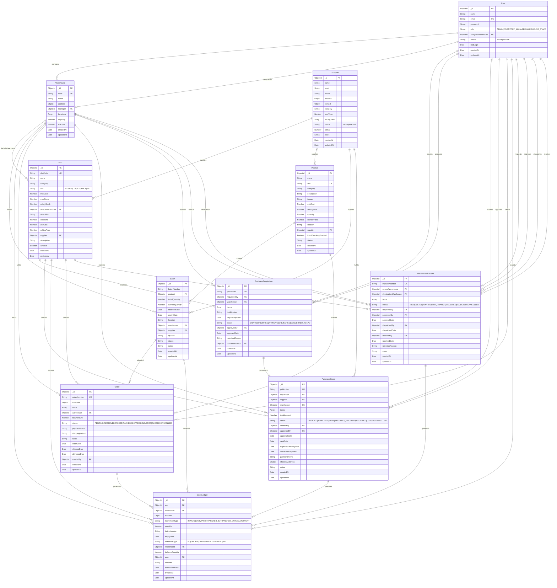
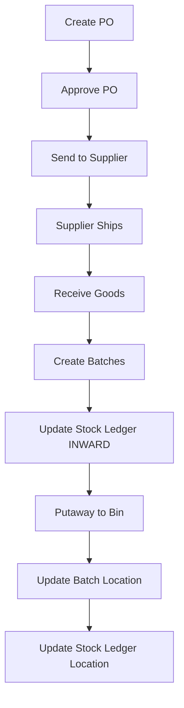
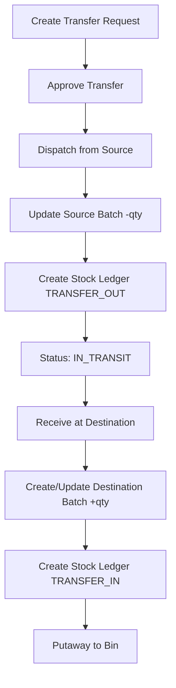
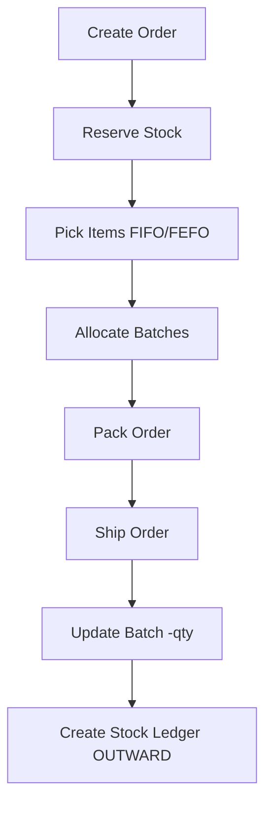

# IMRAS Database Schema Documentation

## Entity Relationship Diagram

## Detailed Schema Breakdown

### 1. User Schema
**Collection:** `users`

| Field | Type | Required | Unique | Default | Description |
|-------|------|----------|--------|---------|-------------|
| _id | ObjectId | Yes | Yes | Auto | Primary key |
| name | String | Yes | No | - | User's full name |
| email | String | Yes | Yes | - | User's email (lowercase) |
| password | String | Yes | No | - | Hashed password (bcrypt) |
| role | String | No | No | WAREHOUSE_STAFF | ADMIN, INVENTORY_MANAGER, WAREHOUSE_STAFF |
| assignedWarehouse | ObjectId | No | No | - | Reference to Warehouse |
| status | String | No | No | Active | Active or Inactive |
| lastLogin | Date | No | No | - | Last login timestamp |
| createdAt | Date | Yes | No | Auto | Document creation date |
| updatedAt | Date | Yes | No | Auto | Last update date |

**Indexes:**
- `email: 1` (unique)

**Relationships:**
- `assignedWarehouse` → Warehouse._id (one-to-one)
- One user manages one warehouse
- One user creates multiple PRs, POs, Orders
- One user records multiple stock movements

---

### 2. Warehouse Schema
**Collection:** `warehouses`

| Field | Type | Required | Unique | Default | Description |
|-------|------|----------|--------|---------|-------------|
| _id | ObjectId | Yes | Yes | Auto | Primary key |
| code | String | Yes | Yes | - | Warehouse code (uppercase) |
| name | String | Yes | No | - | Warehouse name |
| address | Object | No | No | - | Street, city, state, zipCode, country |
| manager | ObjectId | No | No | - | Reference to User |
| locations | Array | No | No | [] | Array of location objects (aisle, bin, capacity) |
| capacity | Number | No | No | 1000 | Warehouse capacity |
| isActive | Boolean | No | No | true | Active status |
| createdAt | Date | Yes | No | Auto | Document creation date |
| updatedAt | Date | Yes | No | Auto | Last update date |

**Indexes:**
- `code: 1` (unique)
- `isActive: 1`

**Relationships:**
- `manager` → User._id (many-to-one)
- One warehouse has many batches
- One warehouse has many stock ledger entries
- One warehouse receives many POs

---

### 3. Supplier Schema
**Collection:** `suppliers`

| Field | Type | Required | Unique | Default | Description |
|-------|------|----------|--------|---------|-------------|
| _id | ObjectId | Yes | Yes | Auto | Primary key |
| name | String | Yes | No | - | Supplier name |
| email | String | Yes | No | - | Supplier email |
| phone | String | Yes | No | - | Phone number |
| address | Object | No | No | - | Street, city, state, zipCode, country |
| contact | Object | No | No | - | Contact person details |
| category | String | No | No | Other | Electronics, Accessories, Office, Other |
| leadTime | Number | No | No | 7 | Lead time in days |
| pricingTiers | Array | No | No | [] | Array of minQty and pricePerUnit |
| status | String | No | No | Active | Active or Inactive |
| rating | Number | No | No | 0 | Rating (0-5) |
| notes | String | No | No | - | Additional notes |
| createdAt | Date | Yes | No | Auto | Document creation date |
| updatedAt | Date | Yes | No | Auto | Last update date |

**Relationships:**
- One supplier supplies multiple SKUs
- One supplier supplies multiple Products
- One supplier provides multiple Batches
- One supplier fulfills multiple POs

---

### 4. Product Schema
**Collection:** `products`

| Field | Type | Required | Unique | Default | Description |
|-------|------|----------|--------|---------|-------------|
| _id | ObjectId | Yes | Yes | Auto | Primary key |
| name | String | Yes | No | - | Product name |
| sku | String | Yes | Yes | - | SKU code (uppercase) |
| category | String | Yes | No | - | Electronics, Accessories, Office, Other |
| description | String | No | No | - | Product description |
| image | String | No | No | '' | Image URL |
| unitCost | Number | Yes | No | - | Unit cost |
| sellingPrice | Number | Yes | No | - | Selling price |
| quantity | Number | Yes | No | 0 | Current quantity |
| reorderPoint | Number | No | No | 10 | Reorder point |
| location | String | Yes | No | - | Storage location |
| supplier | ObjectId | No | No | - | Reference to Supplier |
| batchTrackingEnabled | Boolean | No | No | false | Enable batch tracking |
| status | String | No | No | In Stock | In Stock, Low Stock, Critical, Out of Stock |
| createdAt | Date | Yes | No | Auto | Document creation date |
| updatedAt | Date | Yes | No | Auto | Last update date |

**Indexes:**
- `sku: 1` (unique)

**Relationships:**
- `supplier` → Supplier._id (many-to-one)
- One product has multiple batches
- One product appears in multiple orders

---

### 5. SKU Schema
**Collection:** `skus`

| Field | Type | Required | Unique | Default | Description |
|-------|------|----------|--------|---------|-------------|
| _id | ObjectId | Yes | Yes | Auto | Primary key |
| skuCode | String | Yes | Yes | - | SKU code (uppercase) |
| name | String | Yes | No | - | SKU name |
| category | String | Yes | No | - | Electronics, Accessories, Office, Furniture, Tools, Other |
| unit | String | Yes | No | PCS | PCS, KG, LTR, BOX, PACK, SET |
| minStock | Number | Yes | No | 10 | Minimum stock level |
| maxStock | Number | Yes | No | 100 | Maximum stock level |
| safetyStock | Number | Yes | No | 5 | Safety stock level |
| defaultWarehouse | ObjectId | No | No | - | Reference to Warehouse |
| defaultBin | String | No | No | - | Default bin location |
| leadTime | Number | No | No | 7 | Lead time in days |
| unitCost | Number | Yes | No | - | Unit cost |
| sellingPrice | Number | Yes | No | - | Selling price |
| supplier | ObjectId | No | No | - | Reference to Supplier |
| description | String | No | No | - | SKU description |
| isActive | Boolean | No | No | true | Active status |
| createdAt | Date | Yes | No | Auto | Document creation date |
| updatedAt | Date | Yes | No | Auto | Last update date |

**Indexes:**
- `skuCode: 1` (unique)
- `category: 1`
- `defaultWarehouse: 1`

**Relationships:**
- `supplier` → Supplier._id (many-to-one)
- `defaultWarehouse` → Warehouse._id (many-to-one)
- One SKU appears in multiple PRs, POs, Orders, Transfers
- One SKU has multiple stock ledger entries

---

### 6. Batch Schema
**Collection:** `batches`

| Field | Type | Required | Unique | Default | Description |
|-------|------|----------|--------|---------|-------------|
| _id | ObjectId | Yes | Yes | Auto | Primary key |
| batchNumber | String | Yes | No* | - | Batch number (uppercase) |
| product | ObjectId | Yes | No | - | Reference to Product |
| initialQuantity | Number | Yes | No | - | Initial quantity |
| currentQuantity | Number | Yes | No | - | Current quantity |
| receivedDate | Date | Yes | No | Now | Date received |
| expiryDate | Date | Yes | No | - | Expiry date |
| location | String | Yes | No | - | Storage location |
| warehouse | ObjectId | Yes | No | - | Reference to Warehouse |
| supplier | ObjectId | No | No | - | Reference to Supplier |
| qrCode | String | No | No | - | QR code |
| status | String | No | No | Active | Active, Low Stock, Expiring Soon, Expired, Depleted |
| notes | String | No | No | - | Additional notes |
| createdAt | Date | Yes | No | Auto | Document creation date |
| updatedAt | Date | Yes | No | Auto | Last update date |

**Indexes:**
- `{ batchNumber: 1, warehouse: 1 }` (compound unique) - Same batch number can exist in different warehouses

**Relationships:**
- `product` → Product._id (many-to-one)
- `warehouse` → Warehouse._id (many-to-one)
- `supplier` → Supplier._id (many-to-one)
- One batch can be allocated to multiple orders

---

### 7. Purchase Requisition Schema
**Collection:** `purchaserequisitions`

| Field | Type | Required | Unique | Default | Description |
|-------|------|----------|--------|---------|-------------|
| _id | ObjectId | Yes | Yes | Auto | Primary key |
| prNumber | String | Yes | Yes | Auto | PR number (format: PR000001) |
| requestedBy | ObjectId | Yes | No | - | Reference to User |
| warehouse | ObjectId | Yes | No | - | Reference to Warehouse |
| items | Array | Yes | No | [] | Array of { sku, requestedQuantity, urgency, remarks } |
| justification | String | No | No | - | Justification text |
| requiredByDate | Date | No | No | - | Required by date |
| status | String | No | No | DRAFT | DRAFT, SUBMITTED, APPROVED, REJECTED, CONVERTED_TO_PO |
| approvedBy | ObjectId | No | No | - | Reference to User |
| approvalDate | Date | No | No | - | Approval date |
| rejectionReason | String | No | No | - | Rejection reason |
| convertedToPO | ObjectId | No | No | - | Reference to PurchaseOrder |
| createdAt | Date | Yes | No | Auto | Document creation date |
| updatedAt | Date | Yes | No | Auto | Last update date |

**Indexes:**
- `prNumber: 1` (unique)
- `status: 1`
- `requestedBy: 1`

**Relationships:**
- `requestedBy` → User._id (many-to-one)
- `approvedBy` → User._id (many-to-one)
- `warehouse` → Warehouse._id (many-to-one)
- `convertedToPO` → PurchaseOrder._id (one-to-one)
- `items[].sku` → SKU._id (many-to-many)

---

### 8. Purchase Order Schema
**Collection:** `purchaseorders`

| Field | Type | Required | Unique | Default | Description |
|-------|------|----------|--------|---------|-------------|
| _id | ObjectId | Yes | Yes | Auto | Primary key |
| poNumber | String | Yes | Yes | Auto | PO number (format: PO000001) |
| requisition | ObjectId | No | No | - | Reference to PurchaseRequisition |
| supplier | ObjectId | Yes | No | - | Reference to Supplier |
| warehouse | ObjectId | Yes | No | - | Reference to Warehouse |
| items | Array | Yes | No | [] | Array of { sku, orderedQuantity, receivedQuantity, unitPrice, totalPrice } |
| totalAmount | Number | Yes | No | - | Total amount |
| status | String | No | No | CREATED | CREATED, APPROVED, SENT, PARTIALLY_RECEIVED, RECEIVED, CLOSED, CANCELLED |
| createdBy | ObjectId | Yes | No | - | Reference to User |
| approvedBy | ObjectId | No | No | - | Reference to User |
| approvalDate | Date | No | No | - | Approval date |
| sentDate | Date | No | No | - | Sent date |
| expectedDeliveryDate | Date | No | No | - | Expected delivery date |
| actualDeliveryDate | Date | No | No | - | Actual delivery date |
| paymentTerms | String | No | No | - | Payment terms |
| shippingAddress | Object | No | No | - | Shipping address details |
| notes | String | No | No | - | Additional notes |
| createdAt | Date | Yes | No | Auto | Document creation date |
| updatedAt | Date | Yes | No | Auto | Last update date |

**Indexes:**
- `poNumber: 1` (unique)
- `status: 1`
- `supplier: 1`
- `warehouse: 1`

**Relationships:**
- `requisition` → PurchaseRequisition._id (many-to-one)
- `supplier` → Supplier._id (many-to-one)
- `warehouse` → Warehouse._id (many-to-one)
- `createdBy` → User._id (many-to-one)
- `approvedBy` → User._id (many-to-one)
- `items[].sku` → SKU._id (many-to-many)

---

### 9. Order Schema
**Collection:** `orders`

| Field | Type | Required | Unique | Default | Description |
|-------|------|----------|--------|---------|-------------|
| _id | ObjectId | Yes | Yes | Auto | Primary key |
| orderNumber | String | Yes | Yes | - | Order number (uppercase) |
| customer | Object | Yes | No | - | { name, email, phone, address } |
| items | Array | Yes | No | [] | Array of { product, sku, quantity, reservedQuantity, price, batch } |
| warehouse | ObjectId | No | No | - | Reference to Warehouse |
| totalAmount | Number | Yes | No | - | Total amount |
| status | String | No | No | PENDING | PENDING, RESERVED, PICKED, PACKED, SHIPPED, DELIVERED, CLOSED, CANCELLED |
| paymentStatus | String | No | No | Pending | Pending, Paid, Refunded |
| shippingMethod | String | No | No | - | Shipping method |
| notes | String | No | No | - | Additional notes |
| orderDate | Date | No | No | Now | Order date |
| shippedDate | Date | No | No | - | Shipped date |
| deliveredDate | Date | No | No | - | Delivered date |
| createdBy | ObjectId | No | No | - | Reference to User |
| createdAt | Date | Yes | No | Auto | Document creation date |
| updatedAt | Date | Yes | No | Auto | Last update date |

**Indexes:**
- `orderNumber: 1` (unique)

**Relationships:**
- `warehouse` → Warehouse._id (many-to-one)
- `createdBy` → User._id (many-to-one)
- `items[].product` → Product._id (many-to-many)
- `items[].sku` → SKU._id (many-to-many)
- `items[].batch` → Batch._id (many-to-many)

---

### 10. Stock Ledger Schema
**Collection:** `stockledgers`

| Field | Type | Required | Unique | Default | Description |
|-------|------|----------|--------|---------|-------------|
| _id | ObjectId | Yes | Yes | Auto | Primary key |
| sku | ObjectId | Yes | No | - | Reference to SKU |
| warehouse | ObjectId | Yes | No | - | Reference to Warehouse |
| location | Object | No | No | - | { aisle, bin } |
| movementType | String | Yes | No | - | INWARD, OUTWARD, TRANSFER_IN, TRANSFER_OUT, ADJUSTMENT |
| quantity | Number | Yes | No | - | Movement quantity (+ or -) |
| batchNumber | String | No | No | - | Batch number |
| expiryDate | Date | No | No | - | Expiry date |
| referenceType | String | Yes | No | - | PO, ORDER, TRANSFER, ADJUSTMENT, PR |
| referenceId | ObjectId | Yes | No | - | Reference to source document |
| balanceQuantity | Number | Yes | No | - | Balance after transaction |
| user | ObjectId | Yes | No | - | Reference to User |
| remarks | String | No | No | - | Additional remarks |
| transactionDate | Date | No | No | Now | Transaction date |
| createdAt | Date | Yes | No | Auto | Document creation date |
| updatedAt | Date | Yes | No | Auto | Last update date |

**Indexes:**
- `{ sku: 1, warehouse: 1 }` (compound)
- `movementType: 1`
- `transactionDate: -1`
- `{ referenceType: 1, referenceId: 1 }` (compound)

**Relationships:**
- `sku` → SKU._id (many-to-one)
- `warehouse` → Warehouse._id (many-to-one)
- `user` → User._id (many-to-one)
- `referenceId` → PO/Order/Transfer/PR._id (polymorphic)

---

### 11. Warehouse Transfer Schema
**Collection:** `warehousetransfers`

| Field | Type | Required | Unique | Default | Description |
|-------|------|----------|--------|---------|-------------|
| _id | ObjectId | Yes | Yes | Auto | Primary key |
| transferNumber | String | Yes | Yes | Auto | Transfer number (format: TRF000001) |
| sourceWarehouse | ObjectId | Yes | No | - | Reference to Warehouse |
| destinationWarehouse | ObjectId | Yes | No | - | Reference to Warehouse |
| items | Array | Yes | No | [] | Array of { sku, quantity, batchNumber, expiryDate } |
| status | String | No | No | REQUESTED | REQUESTED, APPROVED, IN_TRANSIT, RECEIVED, REJECTED, CANCELLED |
| requestedBy | ObjectId | Yes | No | - | Reference to User |
| approvedBy | ObjectId | No | No | - | Reference to User |
| approvalDate | Date | No | No | - | Approval date |
| dispatchedBy | ObjectId | No | No | - | Reference to User |
| dispatchedDate | Date | No | No | - | Dispatched date |
| receivedBy | ObjectId | No | No | - | Reference to User |
| receivedDate | Date | No | No | - | Received date |
| rejectionReason | String | No | No | - | Rejection reason |
| notes | String | No | No | - | Additional notes |
| createdAt | Date | Yes | No | Auto | Document creation date |
| updatedAt | Date | Yes | No | Auto | Last update date |

**Indexes:**
- `transferNumber: 1` (unique)
- `status: 1`
- `sourceWarehouse: 1`
- `destinationWarehouse: 1`

**Relationships:**
- `sourceWarehouse` → Warehouse._id (many-to-one)
- `destinationWarehouse` → Warehouse._id (many-to-one)
- `requestedBy` → User._id (many-to-one)
- `approvedBy` → User._id (many-to-one)
- `dispatchedBy` → User._id (many-to-one)
- `receivedBy` → User._id (many-to-one)
- `items[].sku` → SKU._id (many-to-many)

---

## Key Business Rules

### Batch Management
1. **Compound Uniqueness**: Same batch number can exist in different warehouses
   - Index: `{ batchNumber: 1, warehouse: 1 }` (unique)
2. **Status Calculation**: Automatically calculated based on quantity and expiry
3. **Location Tracking**: Updated during putaway operations

### Stock Movement
1. **FIFO/FEFO**: First In First Out / First Expire First Out
2. **Stock Ledger**: Every stock movement creates an entry
3. **Balance Tracking**: Running balance maintained per SKU per warehouse

### Purchase Flow
1. **PR → PO Conversion**: Purchase Requisition can be converted to Purchase Order
2. **Approval Workflow**: 
   - PR: DRAFT → SUBMITTED → APPROVED → CONVERTED_TO_PO
   - PO: CREATED → APPROVED → SENT → RECEIVED

### Transfer Flow
1. **Warehouse Transfer**: REQUESTED → APPROVED → IN_TRANSIT → RECEIVED
2. **Batch Tracking**: Tracks batch numbers during transfer
3. **Stock Ledger Impact**: 
   - Source: TRANSFER_OUT entry
   - Destination: TRANSFER_IN entry

### Location Management
1. **Product Mixing Warning**: System warns when different products assigned to same bin
2. **Putaway**: Updates stock ledger location, doesn't create new entry
3. **Location Format**: `AISLE-SECTION-BIN` or `AISLE-BIN`

---

## Data Flow Diagrams

### Purchase Order Receipt Flow

### Warehouse Transfer Flow

### Order Fulfillment Flow

---

## Collection Statistics

| Collection | Estimated Size | Growth Rate | Critical Indexes |
|------------|---------------|-------------|------------------|
| users | ~100-500 | Low | email |
| warehouses | ~5-20 | Very Low | code |
| suppliers | ~50-200 | Low | name, status |
| products | ~1,000-10,000 | Medium | sku, category |
| skus | ~1,000-10,000 | Medium | skuCode, category |
| batches | ~10,000-100,000 | High | {batchNumber, warehouse} |
| purchaserequisitions | ~1,000-10,000 | Medium | prNumber, status |
| purchaseorders | ~5,000-50,000 | High | poNumber, status |
| orders | ~10,000-100,000 | High | orderNumber, status |
| stockledgers | ~100,000-1M+ | Very High | {sku, warehouse}, transactionDate |
| warehousetransfers | ~1,000-10,000 | Medium | transferNumber, status |

---

## Performance Optimization

### Recommended Indexes (Already Implemented)
1. **User**: `email`
2. **Warehouse**: `code`, `isActive`
3. **SKU**: `skuCode`, `category`, `defaultWarehouse`
4. **Batch**: `{ batchNumber: 1, warehouse: 1 }` (unique compound)
5. **StockLedger**: `{ sku: 1, warehouse: 1 }`, `transactionDate: -1`, `{ referenceType: 1, referenceId: 1 }`
6. **PO**: `poNumber`, `status`, `supplier`, `warehouse`
7. **PR**: `prNumber`, `status`, `requestedBy`
8. **Transfer**: `transferNumber`, `status`, `sourceWarehouse`, `destinationWarehouse`

### Query Optimization Tips
1. Use compound indexes for frequent multi-field queries
2. Sort on indexed fields
3. Use projection to limit returned fields
4. Implement pagination for large result sets
5. Use aggregation pipeline for complex reports

---

## Backup and Maintenance

### Critical Collections (Daily Backup)
- stockledgers
- batches
- purchaseorders
- orders
- warehousetransfers

### Important Collections (Weekly Backup)
- users
- warehouses
- skus
- products
- suppliers
- purchaserequisitions

### Archive Strategy
- Archive orders older than 2 years
- Archive stock ledger entries older than 3 years
- Maintain summary reports for archived data
